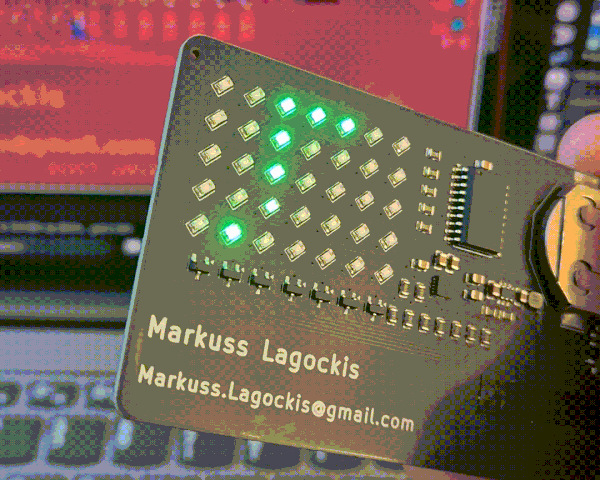
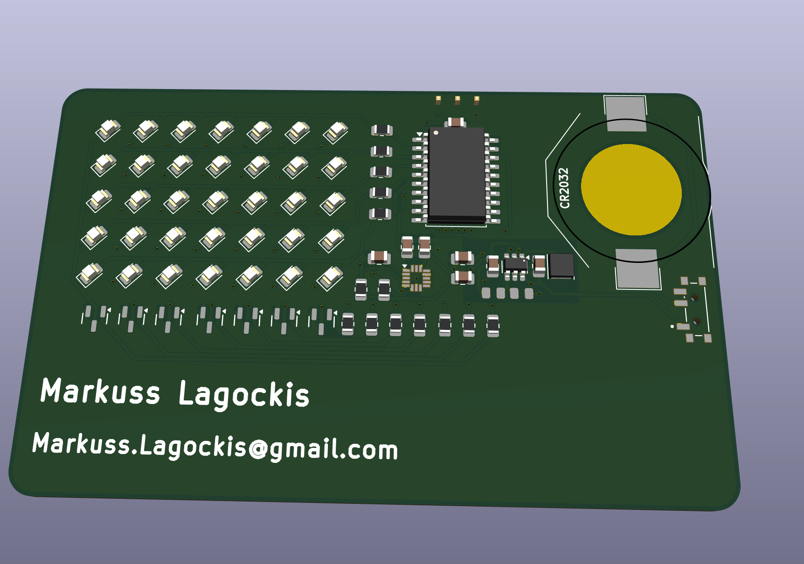
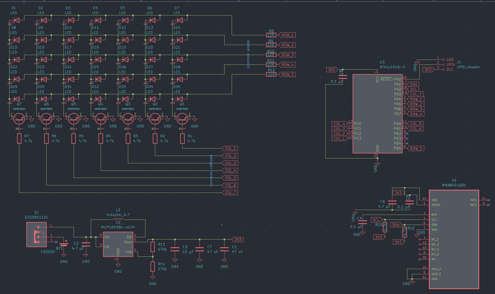

# Snake PCB Business Card

A business card you can play: a tilt-controlled Snake game on a 7×5 LED matrix, powered by a coin cell.



## Why I built it

I designed this card to hand out at TechIndustry, the largest tech expo in the Baltics. A paper card gets thrown away. A card that plays Snake gets passed around.

The original idea was a fluid simulation, but on a 7×5 matrix it just looked like random blinking, so it became Snake instead.

## How to play

- **Flip the switch.** The snake starts moving.
- **Tilt the card** to steer.
- **Crash, and your score appears.** The matrix fills one LED per point. If you fill the whole screen, it rolls over to a second score screen.
- **Shake the card** to start a new game.

## Hardware

| | |
|---|---|
| **MCU** | ATtiny1616 |
| **Accelerometer** | MMA8451 |
| **Power** | CR2032 coin cell → MCP1640 boost converter → stable 3.3 V |
| **Display** | 35 LEDs in a 7×5 multiplexed matrix |
| **PCB** | 2-layer, credit card size, fabricated and assembled by JLCPCB |
| **Cost** | ~€6 per card, assembled |

### How the matrix works

The rows are driven directly from the MCU pins through 22 Ω resistors. The columns are switched by a row of SOT-23 transistors along the bottom of the board. The firmware scans through the columns fast enough that the whole matrix looks lit at once.

The LEDs are rotated 45°. Together with the transistor array underneath, the matrix wiring is some of my cleanest routing work, and it worked on the first try.




## Battery life

- **Switched on:** about 3 days of continuous use
- **Switched off:** about a year or two in storage

## Firmware

Written in the Arduino IDE. The ATtiny1616 is programmed over UPDI, using an Arduino Nano as a makeshift UPDI programmer.

### Flashing

1. Install the [megaTinyCore](https://github.com/SpenceKonde/megaTinyCore) board package in the Arduino IDE.
2. Flash an Arduino Nano with the UPDI programmer sketch (jtag2updi) and wire it to the card's UPDI pin.
3. Select **ATtiny1616** as the board and the Nano as the programmer.
4. Open `firmware/snake/snake.ino` and upload.

## Repository structure

```
hardware/
  kicad/          KiCad project files
  schematic.pdf
  gerbers/        ready to send to a fab
  bom.csv
firmware/
  snake/          Arduino sketch
images/
```

## Status

✅ **v1 finished.** Cards were built, handed out, and work as designed.

🚧 **v2 planned.** The main change: swap the MMA8451 for a proper IMU. The accelerometer isn't responsive enough, so steering can feel sluggish.

## License

Hardware/Firmware: MIT
